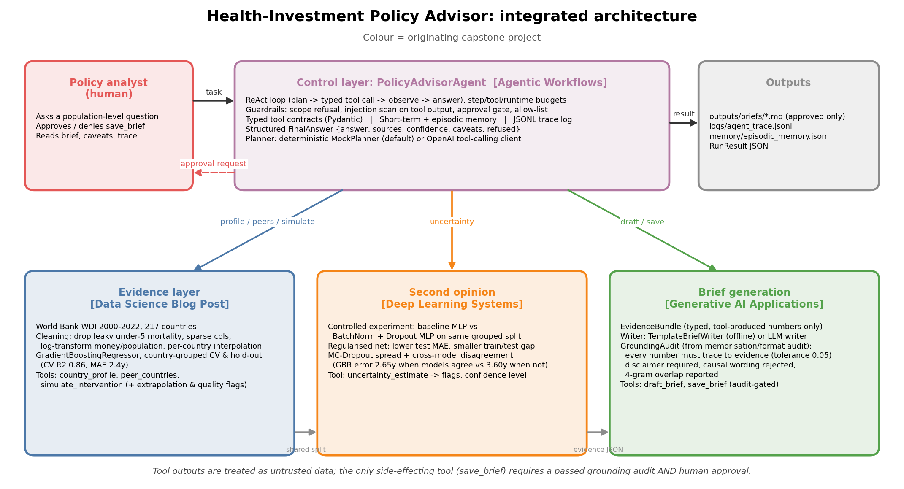

# Health-Investment Policy Advisor — Integrative Industry Synthesis

**Industry:** public policy / international development (ministries of health and finance, development-bank country teams).
**Problem:** decide which national health-investment levers (water, sanitation, electricity, immunisation, schooling, health spending) are associated with longer life expectancy for a given country, and communicate that with honest uncertainty, traceable numbers and human sign-off.

The artifact is a new, integrated system that combines four prior capstone projects into one agent-orchestrated pipeline. It runs fully offline (deterministic planner and template writer) and optionally uses an OpenAI model when `OPENAI_API_KEY` is set.



## Submission map

| Requirement | Location |
|---|---|
| Integrated industry artifact (code) | [`policy_advisor/`](policy_advisor) — `evidence.py`, `neural.py`, `generation.py`, `agent.py` |
| Integrated notebook (executed) | [`policy_advisor_integrated.ipynb`](policy_advisor_integrated.ipynb) (regenerate with `build_notebook.py`) |
| Architecture / workflow diagrams | [`diagrams/architecture.png`](diagrams/architecture.png), [`diagrams/workflow.png`](diagrams/workflow.png) (`diagrams/make_diagrams.py`) |
| Evaluation (11 realistic scenarios incl. failure cases) | [`evaluation/scenarios.json`](evaluation/scenarios.json), [`evaluation/results.md`](evaluation/results.md), `evaluation/run_evaluation.py` |
| Automated tests (13) | [`tests/test_policy_advisor.py`](tests/test_policy_advisor.py) |
| Reflective synthesis paper (1,894 words + references, APA) | [`Reflective_Synthesis_Paper.pdf`](Reflective_Synthesis_Paper.pdf) (source `paper/Reflective_Synthesis_Paper.md`) |
| 15-minute mentor presentation | [`presentation/Mentor_Presentation.pptx`](presentation/Mentor_Presentation.pptx) (13 slides, notes embedded) |
| Speaker notes / defense prep | [`presentation/Speaker_Notes.md`](presentation/Speaker_Notes.md), [`presentation/Defense_QA.md`](presentation/Defense_QA.md) |
| Prior-project artifacts referenced | [`prior_artifacts/`](prior_artifacts) |
| System prompt / operating rules | [`prompts/system_prompt.md`](prompts/system_prompt.md) |
| requirements.txt (`pip freeze`) | [`requirements.txt`](requirements.txt) |

## Integration of prior projects

| Prior project | What it contributes | Where |
|---|---|---|
| **Data Science Blog Post** (World Bank life expectancy) | Cleaned WDI panel, leakage/sparsity rules, country-grouped validation, gradient-boosting model, intervention simulator, peer-country finder, list of systematically mis-predicted countries → evidence-quality flag | `policy_advisor/evidence.py` |
| **Deep Learning Systems** (Fashion-MNIST baseline vs BN+Dropout) | Controlled-experiment methodology reproduced on tabular data; regularised MLP as a *second opinion*; MC-dropout spread and cross-model disagreement as an uncertainty tool | `policy_advisor/neural.py` |
| **Generative AI Applications** (character Transformer + memorisation audit) | Pluggable brief writer (template / OpenAI); memorisation & format audit repurposed as a **grounding audit**: every number must trace to evidence, disclaimer required, causal wording rejected | `policy_advisor/generation.py` |
| **Agentic Workflows** (Research Triage Assistant) | ReAct loop, Pydantic-typed tools, scope refusal, prompt-injection scanning of tool output, budgets, episodic memory, JSONL traces, human approval before side effects, structured JSON output | `policy_advisor/agent.py` |

How they interact: the agent validates scope → retrieves profile/peers/untrusted notes → simulates scenarios (evidence layer) → asks the neural layer for a second opinion → drafts a brief from a typed `EvidenceBundle` → runs the grounding audit → asks a human before `save_brief` → returns `{answer, sources, confidence, caveats, refused}`. Confidence is lowered automatically for low evidence quality, model disagreement, tool failures and rejected drafts.

## Headline results

- Evidence model (grouped 5-fold CV): R² 0.857, MAE 2.43 years; grouped hold-out R² 0.820, MAE 2.96 years.
- Regularised MLP beats baseline MLP (test MAE 2.94 vs 3.14; smaller generalisation gap) but not gradient boosting → used as a second opinion.
- Boosting error is 2.65 years when the two models agree and 3.60 years when they disagree (32% of hold-out rows).
- Template brief for Nigeria: 37/37 numbers grounded; fabricated text is rejected.
- Evaluation: **11/11 scenarios pass** (golden paths, scope refusals, prompt injection in tool output, denied approval, tool outage, hallucinating writer, low evidence quality, memory recall). Tests: **13/13 pass**.

## Reproduce

```bash
python3 -m venv .venv && source .venv/bin/activate
pip install -r requirements.txt            # CPU torch; ~2 min

pytest -q                                  # 13 tests (first run fits & caches models, ~90 s)
python -m evaluation.run_evaluation        # -> evaluation/results.{json,md}
python diagrams/make_diagrams.py           # -> diagrams/*.png
python build_notebook.py && jupyter nbconvert --to notebook --execute --inplace policy_advisor_integrated.ipynb
python paper/build_paper.py                # -> Reflective_Synthesis_Paper.pdf
python presentation/build_slides.py        # -> presentation/Mentor_Presentation.pptx + Speaker_Notes.md
```

Fitted models are cached in `outputs/models/*.pkl` (git-ignored; rebuilt automatically). Set `OPENAI_API_KEY` to use the LLM planner/writer; without it the deterministic `MockPlanner` and `TemplateBriefWriter` run.

Quick interactive use:

```python
from policy_advisor.evidence import EvidenceBase
from policy_advisor.neural import NeuralComparison
from policy_advisor.agent import PolicyAdvisorAgent, Guardrails

ev = EvidenceBase.load_or_build(); nn = NeuralComparison.load_or_build(ev)
agent = PolicyAdvisorAgent(ev, nn, approval_callback=Guardrails.interactive)  # or Guardrails.auto_deny
print(agent.run("Should Nigeria prioritise water and sanitation or double health spending? Save the brief.").model_dump_json(indent=2))
```

## Boundaries and responsible use

- Associational, not causal: scenario gains describe countries that already have those indicator levels.
- Population-level only: refuses individual medical advice, diagnosis or dosing, and political persuasion.
- Numbers in briefs must trace to tool output; ungrounded drafts are never saved.
- Tool output (including analyst notes) is untrusted data; injected instructions are flagged and ignored.
- Nothing is written to disk without human approval; every run leaves a JSONL trace in `logs/`.
- Known limits: national/annual data, independent levers, no cost model, heuristic confidence, regex guardrails, narrow offline planner.

## Data

`data/world_bank_indicators.csv` — World Bank World Development Indicators, 2000–2022, as prepared in the Data Science Blog Post project. `data/country_notes.json` — synthetic analyst notes used to exercise the untrusted-data guardrail (includes a deliberate prompt injection for KHM).
